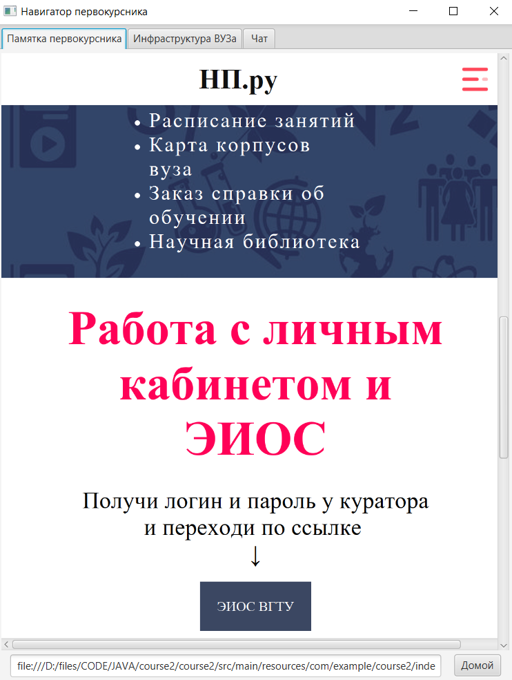

# Навигатор первокурсника

1. [WebVIew : Памятка первокурсника](#WebVIew)
2. [Info : Фигуры(фабричный метод)](#Info)
3. [Chat : BMI](#Chat)

## WebVIew <i>(памятка первокурсника)</i>

## Info <i>(Инфраструктура фуза)</i>

## Chat <i>(Чат)</i>

